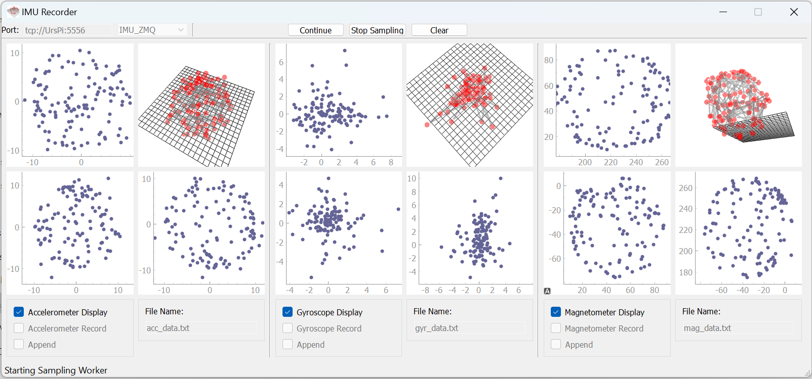

# freeIMUCal
IMU Calibration using ZMQ or serial connection to an IMU. The resulting offsets and axis scales will improve the IMU accuracy.

Run ```IMURec.py```

The purpose of this distribution is to calibrate IMU sensors with the following model:

$$ S_c = (S_m - offset) * M_c $$

$$offset = [x,y,z]$$
$$M_c = [[s_x,m_{01}, m_{02}],[m_{10}, s_y, m_{12}],[m_{20},m_{21},s_z]] $$

Often $m_{01}..m_{21}$ are $0.0$ and $s_x,s_y,s_z$ (scales) are close to $1.0$




## Background
This work is based on Fabio Varesano's [implementation](https://www.researchgate.net/publication/258817923_FreeIMU_An_Open_Hardware_Framework_for_Orientation_and_Motion_Sensing) of [FreeIMU](https://github.com/Fabio-Varesano-Association/freeimu)

## Dependencies
- PyOpenGL `sudo apt-get install python3-PyOpenGL` or `pip install PyOpenGl`
- PyQt5 `sudo apt-get install python3-PyQt5`  or `pip install PyQt5`
- pyqtgraph `sudo apt-get install python3-pyqtgraph`  or `pip install pyqtgraph`

Files needed from this distribution:
- cal_lib.py which includes ellipsoid_fit to fit ellipsoid to [x,y,z] data
- imu_recorder.ui user interface with 3D graphs

You will need an IMU board and program that reads its data and transfers it either to a serial port or via ZMQ. You can see example for Samsung gearVR controller in the author's [gearVRC](https://github.com/uutzinger/gearVRC) repository.

## Installing Virtual Serial Port
You can connect to your IMU by creating 2 virtual serial port, where the IMU driver sends data to and the calibration program is picking it up from. I will add this code to the display program soon. 

- Linux

See explanation of the different virtual serial drivers https://www.baeldung.com/linux/make-virtual-serial-port

```
sudo apt-get install -y socat
socat -d -d pty,rawer,echo=0,link=/tmp/ttyV0 pty,rawer,echo=0,link=/tmp/ttyV1
in one terminal
minicom -D /tmp/ttyV0 -b 115200
in other terminal
minicom -D /tmp/ttyV1 -b 115200
```

For IMU Calibration use `socat -d -d pty,rawer,echo=0,link=/tmp/ttyV0 pty,rawer,echo=0,link=/tmp/ttyV1&` which creates ttyV0 for the program reporting IMU data and ttyV1 for freeIMUCal to receive data. socat connects the two interfaces via a virtual nullmodem cable meaning sending to ttyV0 will arrive at the ttyV1 receiver and sending to ttyV1 will arrive at tty0 receiver.

- Windows
[com0com](https://sourceforge.net/projects/com0com/)

## Usage
I use ```IMURec.py``` program to record data.

Then copy your data in the the ```compute_model``` folder.

Modify and use ```calibrateAcc_example.py``` to create the correction JSON files. Change the filename for Gyr and Mag to calibrate the gyroscope and magnetomter.

There are up to three sensors to calibrate:
- `Magnetometer`

The magnetometer needs to be calibrated in a magnet and motor free environment (remove your smartwatch, keep electric motors away, stay away from elevator). You should obtain a good distribution of numbers on all locations along the sphere. Usually there is a significant offset.

- `Gyroscope`

For the gyroscope you need a turn table used to play vinyl records. It has a setting for 33.333 RPM and 45 RPM usually the players are accurate. You will need to place the sensor on the table in different orientations and record the data in steps by pausing recording when you change the orientation. You should give the turntable some time to come to full speed. To record the offset you can include recordings when the turn table is off and sort that data out in the example calibration program. Its difficult to obtain a large number of orientations and its best to just fit the scales and not cross axis sensitivity.

- `Accelerometer`

You will need to gently waggle the sensor. You will want to cover as many sections of the spherical surface as possible by systematically rotating the sensor. You can record the accelerometer and magnetometer simultaneously. You should not record gyroscope readings during these readings.

### Results
The calibration fits should produce an offset as well as scaling in all three directions. You can enable fit option to compute cross axis sensitivity. Its unlikely that the cross axis sensitivity is significant compared to orientation shifts between the three sensors, which are difficult to measure. The scales are the diagonal elements of the correction matrix.
At this time I was unable to record a dataset that gave reasonable cross axis sensitivity numbers.

You can use [pypi AHRS](https://pypi.org/project/AHRS/) World Magnetic Model and World Geodetic System to compute absolute value of gravity and magnetic field at your location and adjust the scaling accordingly.

Using the WMM you can figure out the angle between the accelerometer and the magnetometer and correct for misalignment due to solder or assembly errors. Your accelerometer and gyroscope values would need to be measured as pairs. After above correcting, you can calculate the cross product between the gravity and magnetic field and the average would need to match the cross product of the WMM computed vector with gravity. 